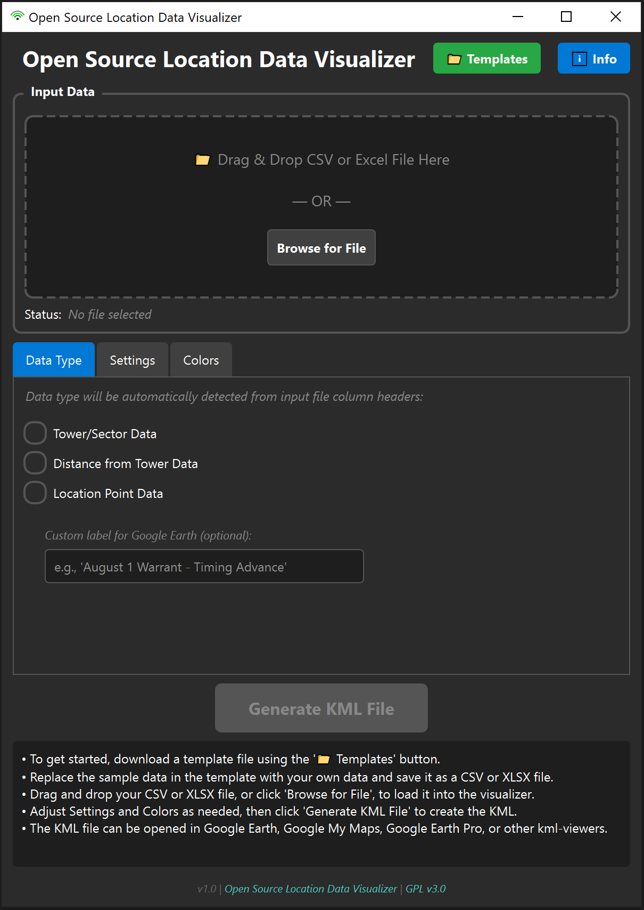

# Open Source Location Data Visualizer

A standalone desktop application for **quick triage and initial visualization** of location data. This tool converts data containing tower/sector, distance from tower, and location point information into KML files for preliminary analysis.

⚠️ **IMPORTANT: This is for initial review only. All findings must be analyzed and verified.**

## Features

### 🎯 **Data Type Support**

- **Tower/Sector Data**: Creates directional wedges with azimuth (does not depict coverage)
- **Distance from Tower Data**: Generates distance-based arcs from tower
- **Location Point Data**: Displays points with accuracy radius circles

### 🎨 **Customizable Visualization**

- Adjustable sector width
- Color-coded data types with customizable colors
- Time animation support for chronological display

### 🖥️ **User-Friendly Interface**

- Drag-and-drop file input
- Built-in sample templates for proper formatting

## Application Screenshot

<div align="center">
  
</div>

## How to Use

1. Download a **template file** using the Templates button in the program.
2. Copy and paste your data from your records into the matching columns in the template file and save it as your **input file**.
3. Drag and drop your input file into the program, or use the Browse for File button.
4. The program will automatically recognize the data type based on the column headers in your input file.
5. Adjust any visualization settings as needed and (optionally) add a label to describe the data.
6. Click Generate to create a KML file.
7. Open the KML file in Google Earth, Google Earth Pro, or other GIS software to view your data.

### Data Format Reference

**For Tower/Sector Data:**
- `Timestamp`, `Latitude`, `Longitude`, `Azimuth`

**For Distance from Tower Data:**
- `Timestamp`, `Latitude`, `Longitude`, `Azimuth`, `Distance`

**For Location Point Data:**
- `Timestamp`, `Latitude`, `Longitude`, `Accuracy` (optional)

### Supported Timestamp Formats

The application supports **18+ timestamp formats**, including:

**Common Formats:**
- ISO: `2025-01-15T14:30:00`, `2025-01-15 14:30`, `2025/02/11 11:06:07`
- US (4-digit year): `01/15/2025 2:30 PM`, `01/15/2025 2:30`, `08/01/2015 22:14:13`
- US (2-digit year): `07/30/24 13:00:20` (auto-converts: 00–30 → 2000–2030, 31–99 → 1931–1999)
- European: `15.01.2025 14:30:00`, `15.01.2025 14:30`
- Time-only: `14:30:00`, `2:30 PM` (uses today's date)

**Advanced Formats:**
- Excel serial dates: `45696.7637037037`
- With timezone: `2025-02-11 11:06:07.557 EST`, `2019/05/03 18:36:04 (GMT -4)` (timezone automatically stripped)

**Note:** Data sets with missing azimuth, distance, or accuracy values will still process. The visualizations will reflect only the data provided, and alert messages will notify you of any missing fields.

### Viewing in Google Earth

1. Open Google Earth Pro or Google Earth Web
2. Import the generated KML file (File → Import or drag-and-drop)
3. Use Google Earth's timeline controls for chronological playback
4. Zoom, pan, and explore the visualized location data
5. Google Earth Pro can be used offline to view your KML file, as long as the map areas have been previously loaded while connected to the internet

---

## Open Source & Contributing

This is an open source project. Found a bug or have a suggestion? [Contribute or open an issue on GitHub.](https://github.com/btc-git/OS-LOC-DAT-VIZ)


## Installation & Distribution

### For End Users

Download the standalone executable `OS-LocationDataVisualizer.exe` - no Python installation required.

### For Developers

**Requirements:**

- Python 3.11+
- PyQt6
- pandas
- openpyxl

**Setup & Installation:**

1. Clone the repository
2. Install dependencies:
   ```bash
   pip install -r requirements.txt
   ```
3. Run from source:
   ```bash
   python app.py
   ```

**Building the Executable:**

1. Install PyInstaller:
   ```bash
   pip install pyinstaller
   ```
2. Build the executable:
   ```bash
   pyinstaller --onefile --windowed --name "OS-LocationDataVisualizer" --icon=wifi_icon.ico --exclude-module=matplotlib --exclude-module=scipy --exclude-module=numba --noupx app.py
   ```
3. Find the executable in the `dist/` directory (the file will be named `OS-LocationDataVisualizer.exe`)

## Important Disclaimers

⚠️ **All outputs require verification**

- **This tool is designed for quick preliminary review and visualization**
- **NO COVERAGE ESTIMATIONS**: All shaded areas, wedges, and circles are visual representations only - NOT coverage depictions
- Distance from tower measurements, sector areas, and location accuracy should all be independently validated
- This tool does not replace professional forensic analysis or expert work

## Sample Data Templates

The application includes built-in templates for each data type. Click the "📁 Templates" button in the application to download properly formatted CSV files with sample data and correct column headers.

---
## License

This project is licensed under the GNU General Public License v3.0 - see the [LICENSE](LICENSE) file for details.

This program is free software: you can redistribute it and/or modify it under the terms of the GNU General Public License as published by the Free Software Foundation, either version 3 of the License, or (at your option) any later version.

This program is distributed in the hope that it will be useful, but WITHOUT ANY WARRANTY; without even the implied warranty of MERCHANTABILITY or FITNESS FOR A PARTICULAR PURPOSE. See the GNU General Public License for more details.

---
Copyright (c) 2025 CrimLawTech LLC
**Version 1.0**  
_Open Source Location Data Visualization Tool_
