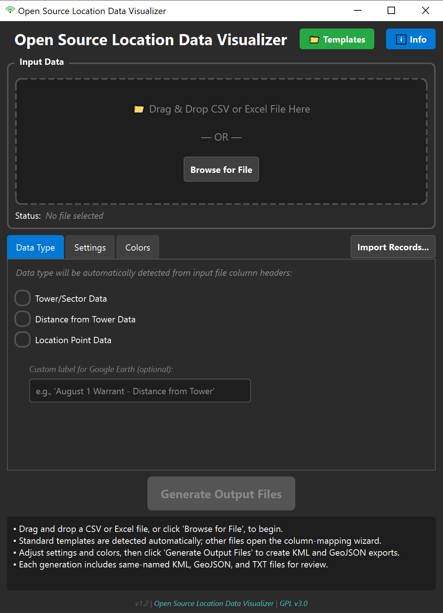

# Open Source Location Data Visualizer

### Development Transparency
This application was developed with AI assistance and has undergone human review and testing. The program itself does not use AI. As with any AI-assisted software, additional scrutiny and verification are recommended before critical use.

---

A standalone desktop application for **quick triage and initial visualization** of location data. This tool converts data containing tower/sector, distance from tower, and location point information into paired KML and GeoJSON files for preliminary analysis.

⚠️ **IMPORTANT: This is for initial review only. All findings must be analyzed and verified.**

<a href="https://github.com/btc-git/OS-LOC-DAT-VIZ/releases/latest/download/OS-LocationDataVisualizer.exe" style="text-decoration:none;font-weight:bold;font-size:1.1em;">
⬇️ Download the latest OS-LocationDataVisualizer.exe
</a>
<br>

## Features

### 🎯 **Data Type Support**

- **Tower/Sector Data**: Creates directional wedges with azimuth (does not depict coverage)
- **Distance from Tower Data**: Generates distance-based band visualization with configurable inner/outer band thickness
- **Location Point Data**: Displays points with accuracy radius circles

### 🎨 **Customizable Visualization**

- Adjustable sector width, leg length, and shaded area length
- Configurable distance band (inner/outer) for Distance from Tower data
- Color-coded data types with customizable colors
- Configurable unit support (Meters, Feet, Miles, Kilometers)
- Time animation support for chronological display

### **Output & Interoperability**

- Paired KML and GeoJSON exports with matching event and dataset metadata
- KML output for Google Earth Pro and compatible GIS software
- GeoJSON output optimized for GeoLibre/MapLibre workflows
- Included [GeoLibre viewer plugin](GeoLibre-Plugin/README.md) for filtering, timeline playback, labels, and event details
- Direct **Save Outputs**, **Save & Open Viewer**, and **Open Viewer** actions using the included GeoLibre Desktop 3.0.0 portable viewer
- Same-named TXT generation log with source/output hashes, settings, row outcomes, and warnings

### 🖥️ **User-Friendly Interface**

- Drag-and-drop CSV, XLS, and XLSX input
- Built-in sample XLSX templates for proper formatting
- Automatic column-mapping wizard for files that do not match a standard template
- Optional inclusive date/time range filtering during import
- Named timezone and fixed UTC-offset handling
- Human-readable TXT generation log with hashes, settings, row outcomes, and warnings

## Application Screenshot

<div align="center">
  
</div>

## How to Use

1. Drag and drop a CSV or Excel file into the program, or use the Browse for File button.
2. A file using the application’s standard template headers is recognized automatically.
3. For other files, the column-mapping wizard opens automatically. Select the worksheet and header row, choose the record type, review the suggested mappings, and optionally limit the import to an inclusive date/time range.
4. Review the timezone, slash/dash date order, units, and visualization settings.
5. Click **Save Outputs** to create the KML, GeoJSON, and TXT generation log, or **Save & Open Viewer** to create them and immediately open the GeoJSON in the included viewer. Use **Open Viewer** to review existing KML or GeoJSON files without generating new outputs.
6. Review warnings and row outcomes in the TXT log. All visualizations remain preliminary and require independent expert review.

Each generation writes a `.kml`, `.geojson`, and `.txt` file with the same base name. The log records source and output SHA-256 hashes, import mappings, timestamp interpretation, visualization settings, row outcomes, and warnings without copying source-record contents.

**Save & Open Viewer** also writes a same-named `.geolibre` companion project. **Open Viewer** starts a clean, plugin-enabled session. Use the prominent **Load GeoJSON** button beneath the viewer-panel title for previous OS-LOC exports; repeat it to add more record sets. KML files remain available through GeoLibre drag and drop. On first use, the application verifies and extracts its pinned GeoLibre portable bundle and installs the included OS-LOC viewer plugin in GeoLibre's per-user plugin directory. Viewer projects activate the plugin, open its panel, and hide unrelated toolbar controls. A generated companion project also shows and frames its generated events automatically. Because GeoLibre enforces one running instance per Windows session, close any other GeoLibre window before starting the included viewer.

For original carrier records that do not match a template, the import wizard opens automatically. It supports CSV, XLS, and XLSX files; worksheet and header-row selection; record-type selection; explicit column mapping; and optional inclusive date/time range filtering. Date selections include the complete start and end days by default; select **Use exact times** for narrower boundaries. **Check Matching Rows** reports both timestamp matches and rows with valid mapped coordinates before import. The filter uses the selected timezone interpretation, excludes timestamps that cannot be parsed or uniquely resolved, and records all filter counts and boundaries in the TXT generation log. Its live preview shows the first 25 source rows with each original column header and the application field currently mapped to it. Azimuth may be left unmapped when it is unavailable; the application will use a 360-degree visualization. Imported records are normalized in memory and the original file is not modified.

### Data Format Reference

**For Tower/Sector Data:**
- `Timestamp`, `Latitude`, `Longitude`, `Azimuth`

**For Distance from Tower Data:**
- `Timestamp`, `Latitude`, `Longitude`, `Azimuth`, `Distance`

**For Location Point Data:**
- `Timestamp`, `Latitude`, `Longitude`, `Accuracy` (optional)

The templates use one combined `Timestamp` column, which is recommended. Input files may instead use separate `Date` and `Time` columns, including common variants such as `Conn. Date` and `Conn. Time (UTC)`. Common combined fields such as `Start DateTime`, `StartTime`, `Record Open Date/Time`, and `Msg Send Date` are also recognized.

### Supported Timestamp Formats

The application supports **18+ timestamp formats**, including:

**Common Formats:**
- ISO: `2025-01-15T14:30:00`, `2025-01-15 14:30`, `2025/02/11 11:06:07`
- US (4-digit year): `01/15/2025 2:30 PM`, `01/15/2025 2:30`, `08/01/2015 22:14:13`
- US (2-digit year): `07/30/24 13:00:20` (auto-converts: 00–30 → 2000–2030, 31–99 → 1931–1999)
- European: `15.01.2025 14:30:00`, `15.01.2025 14:30`
- Time-only: `14:30:00`, `2:30 PM` (uses today's date)

**Advanced Formats:**
- Excel serial dates: `45696.7637037037`
- With timezone: `2025-02-11 11:06:07.557 EST`, `2019/05/03 18:36:04 (GMT -4)`, `2025-01-15T14:30:00Z` (converted to UTC for KML)
- Without timezone: Uses the selected Source Timestamp UTC Offset (UTC by default); an explicit offset in a record takes precedence
- Fixed offsets are shown with familiar North American abbreviations where useful; the numeric UTC offset is authoritative because abbreviations can be ambiguous
- Ambiguous slash or dash dates use the selected Month/Day/Year or Day/Month/Year order; year-first dates are unaffected
- Named timezones apply historical daylight-saving rules. Ambiguous or nonexistent transition times are omitted from KML and reported by data-row number rather than assigned an assumed instant

**Note:** Data sets with missing azimuth, distance, or accuracy values will still process. The visualizations will reflect only the data provided, and alert messages will notify you of any missing fields.


---

## Open Source & Contributing

This is an open source project. Found a bug or have a suggestion? [Open an issue or suggest a feature here.](https://github.com/btc-git/OS-LOC-DAT-VIZ/issues)


## Installation & Distribution

### For End Users

Download the standalone executable `OS-LocationDataVisualizer.exe` - no Python installation required.

### For Developers

**Requirements:**

- Python 3.11+
- PyQt6
- pandas
- openpyxl
- xlrd
- tzdata

**Setup & Installation:**

1. Clone the repository
2. Install dependencies:
   ```bash
   python -m pip install -r requirements.txt
   ```
3. Run from source:
   ```bash
   python app.py
   ```

**Run Tests:**

```bash
python -m unittest discover -s tests -v
node tests/test_plugin_simplified_chrome.mjs
```

**Building the Executable:**

1. Install PyInstaller:
   ```bash
   python -m pip install pyinstaller
   ```
2. Build the executable:
   ```bash
   # Option 1: Use the spec file (recommended)
   python -m PyInstaller --clean app.spec

   # Option 2: Full command-line
   python -m PyInstaller --onefile --windowed --name "OS-LocationDataVisualizer" --icon=wifi_icon.ico --exclude-module=matplotlib --exclude-module=scipy --exclude-module=numba --noupx app.py
   ```
3. Find the executable in the `dist/` directory (the file will be named `OS-LocationDataVisualizer.exe`)

## Privacy & Security

Location-data processing and export run locally; the application does not upload source or output files. Generated KML, GeoJSON, TXT, and GeoLibre project files can contain sensitive location information and should be handled accordingly. The included viewer loads its default basemap from OpenFreeMap, which requires a network connection and discloses ordinary tile-request metadata such as IP address and viewed map area to that service. Opening project links or exported files in other applications is subject to those applications' behavior.

## Important Disclaimers

- **This tool is in continuous development and may contain errors.**
- **This tool is designed for quick preliminary review and visualization. All outputs require verification.**
- **NO COVERAGE ESTIMATIONS**: All shaded areas, wedges, and circles are visual representations only - NOT coverage depictions
- Distance from tower measurements, sector areas, and location accuracy should all be independently validated
- This tool does not replace professional forensic analysis or expert work

## Sample Data Templates

The application includes built-in templates for each data type. Click the "📁 Templates" button in the application to download properly formatted XLSX files with sample data and correct column headers.

---
## License

This project is licensed under the GNU General Public License v3.0 - see the [LICENSE](LICENSE) file for details.

This program is free software: you can redistribute it and/or modify it under the terms of the GNU General Public License as published by the Free Software Foundation, either version 3 of the License, or (at your option) any later version.

This program is distributed in the hope that it will be useful, but WITHOUT ANY WARRANTY; without even the implied warranty of MERCHANTABILITY or FITNESS FOR A PARTICULAR PURPOSE. See the GNU General Public License for more details.

---
Copyright (c) 2025-2026 CrimLawTech LLC
**Version 1.2**
_Open Source Location Data Visualization Tool_
